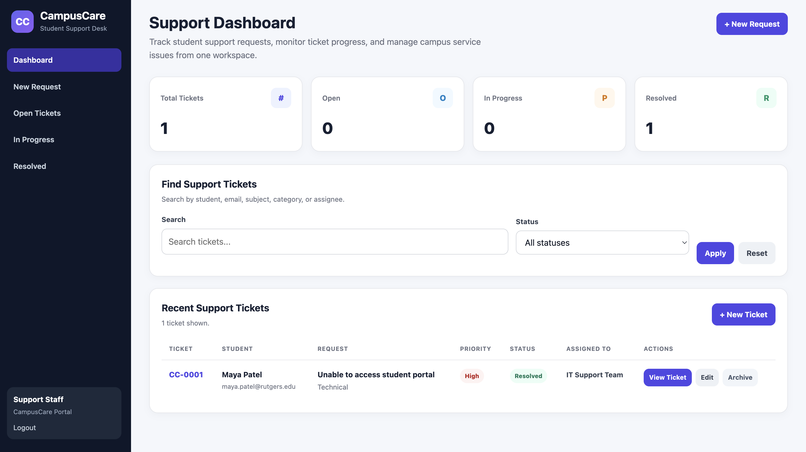
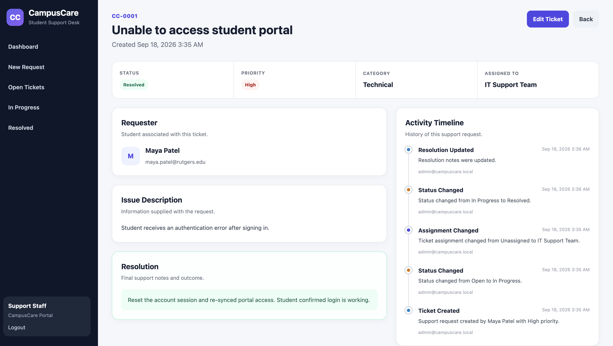
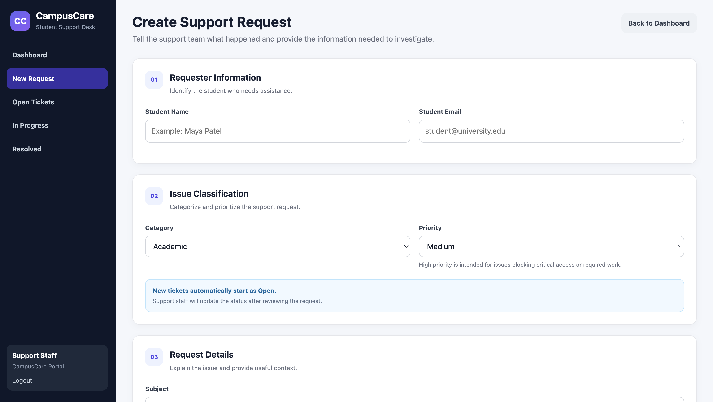
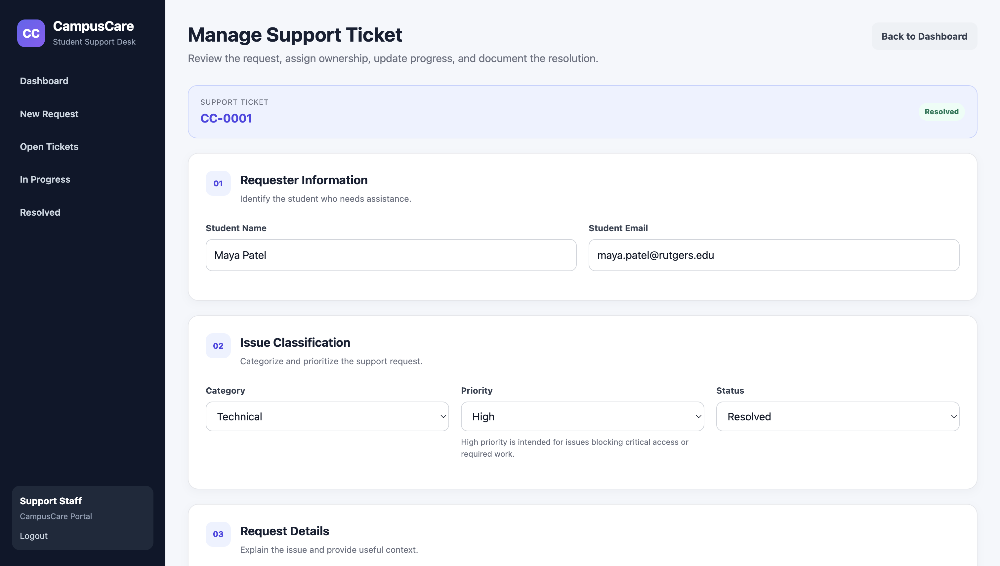
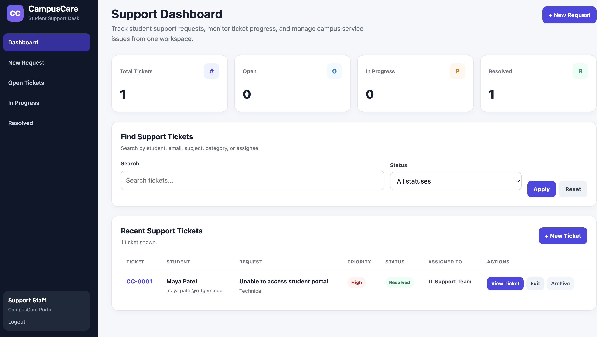

# CampusCare

CampusCare is a student support request management system built with PHP and SQLite. It provides a simple help-desk workflow for creating, assigning, tracking, resolving, and archiving campus support tickets.

## Live Demo

https://campuscare-php.onrender.com

## Features

- Secure staff login with password hashing and PHP sessions
- Create student support requests
- Ticket categories and priorities
- Support workflow with:
  - Open
  - In Progress
  - Resolved
- Assign tickets to support staff or teams
- Add resolution notes
- Search tickets by student, email, subject, category, or assignee
- Filter tickets by status
- Dashboard metrics for active tickets
- Detailed ticket pages
- Ticket activity timeline
- Archive tickets without permanently deleting their history
- Responsive support-dashboard interface
- SQLite database with automatic schema migration
- Production admin credentials configurable through environment variables

## Tech Stack

- PHP
- SQLite
- PDO
- HTML
- CSS
- PHP Sessions
- Docker
- Render
- Git
- GitHub

## Screenshots

### Support Dashboard



### Ticket Details and Activity Timeline



### New Support Request



### Ticket Workflow



### Login Page



## Ticket Workflow

A typical support request moves through the following process:

1. A support request is created.
2. New tickets automatically begin with an **Open** status.
3. Support staff review the request.
4. The ticket can be assigned to a support team or staff member.
5. The status can be changed to **In Progress**.
6. Support staff record resolution notes when the issue is resolved.
7. The ticket is marked **Resolved**.
8. Completed tickets can be archived while preserving their history.

## Activity Tracking

CampusCare records important ticket changes, including:

- Ticket creation
- Status changes
- Priority changes
- Assignment changes
- Resolution updates
- General ticket updates
- Ticket archiving

This creates a clear history of how each support request was handled.

## Project Structure

```text
campuscare-php/
├── assets/
│   └── style.css
├── data/
│   └── campuscare.sqlite
├── screenshots/
│   ├── login-page.png
│   ├── support-dashboard.png
│   ├── new-request-form.png
│   ├── ticket-details.png
│   └── ticket-workflow.png
├── config.php
├── delete_ticket.php
├── Dockerfile
├── index.php
├── login.php
├── logout.php
├── ticket.php
├── ticket_form.php
└── README.md
```

## Running Locally

### 1. Clone the repository

```bash
git clone https://github.com/HaripriyaReddyPatil/campuscare-php.git
cd campuscare-php
```

### 2. Start the PHP development server

```bash
php -S localhost:8002
```

### 3. Open the application

```text
http://localhost:8002
```

## Local Demo Login

For local development, the default administrator account is:

```text
Email: admin@campuscare.local
Password: Admin123!
```

Production deployments can override these values using environment variables.

## Environment Variables

CampusCare supports the following environment variables:

```text
CAMPUSCARE_ADMIN_EMAIL
CAMPUSCARE_ADMIN_PASSWORD
```

These allow production administrator credentials to remain outside the source code.

## Deployment

The application is containerized using Docker and deployed on Render.

The SQLite database is automatically created when the application starts.

## Security Features

- Password hashing with `password_hash()`
- Password verification with `password_verify()`
- Session-based authentication
- Session ID regeneration after login
- PDO prepared statements
- Output escaping with `htmlspecialchars()`
- Environment-based production admin credentials
- Tickets are archived instead of permanently deleted

## Future Improvements

Possible extensions include:

- Separate student and staff accounts
- Email notifications
- File attachments
- Staff assignment management
- Archived ticket management page
- Analytics and reporting
- Role-based permissions

## Author

Haripriya Reddy Patil

MS Computer Science  
Rutgers University – New Brunswick